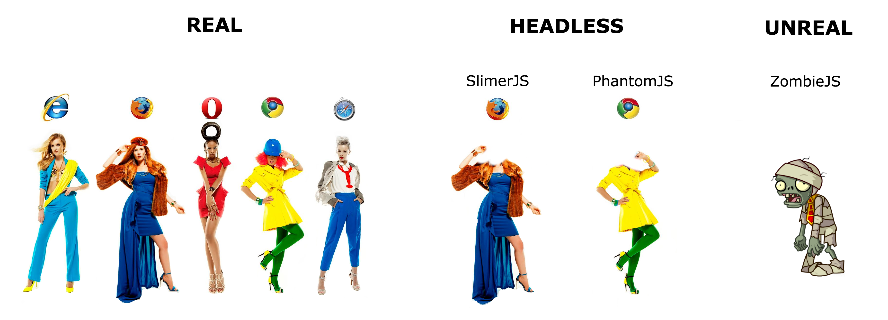
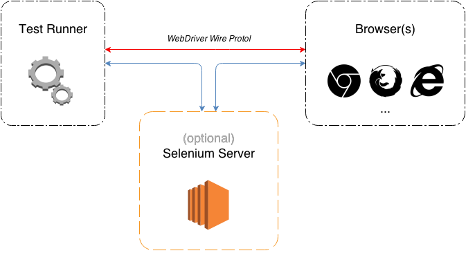

# Make the Browsers Work for You

## Goals
The main goals of this article are the following:

* Explain what integration testing is
* Demonstrate scenarios when integration tests are useful
* Provide clarity & overview of testing tools & frameworks

After reading this article you will know all of that.


## Introduction
Front end development has grown a lot in recent years. Modern websites, or rather web applications, can be in different states and sometimes there is more than one way to get to the same state. Furthermore, modern web applications are expected to run on anything from iPhone to the 40" TV in your living room. Running unit tests on the JavaScript modules individually is still helpful but it is not enough. We should run our tests the same way our users actually interact with the website. Do they use the mouse, their thumbs or special keys on their remote control? Maybe a combination of everything at the same time? We also need to ensure that the right data is made available on different states and that transitions between pages (or states) happen as expected. We need integration tests, which are also referred as end-to-end tests or E2E tests.

Integration tests are executed in real browsers, real DOM events are triggered (click, touch, submit, etc) and real DOM elements are modified.


## Browsers explained


_Real_ browsers are traditional browsers. They are primary targets where integration tests are carried.

_Headless_ browsers are based on traditional browsers but don't have a GUI. They can only be controlled programmatically.

_Unreal_ browsers are a compilation of tools and plugins that can perform HTTP requests, parse HTML and some do other things that traditional browsers can do. They have no GUI and strictly speaking are not browsers at all. (very limited support of features, e.g. Cookies, HTML5 APIs, navigation history, etc)


## Selenium & WebDriver Explained
There is a lot confusion about the terminology used in the Selenium world. Let's figure it out.

The initial approach for integration testing was record and play. An automation tool would record keyboard and mouse interactions storing timings between events and precise coordinates of mouse clicks.

In the year 2004 Jason Huggins came up with an idea to make a better tool for browser automation. He developed a JavaScript library that could drive interactions with the page, allowing the user to automatically rerun tests against multiple browsers. That library is referred now as as Selenium Remote Control.

> Side note: The name Selenium comes from a joke made by the original developer in an email, mocking a competitor named Mercury, saying that you can cure mercury poisoning by taking Selenium supplements. The others that received the email took the name and ran with it.

The JavasScript automation engine used by the Selenium RC was limited by security restrictions implemented in the browsers.

In 2006 a developer at Google, Simon Stewart, released a tool that spoke directly to the browser using the native method for the given browser and the operating system, thus avoiding the restrictions of a sandboxed JavaScript environment. He called it WebDriver.

In the year 2009, the two projects were merged into one. The merged project received an official name Selenium-WebDriver. It is also referred as Selenium WebDriver or Selenium 2.0. Since the year 2009 both words Selenium and WebDriver also mean the merged project Selenium-WebDriver. This could be very confusing for people who are starting with E2E tests.

> Side note: Sometimes you might find services that say they support WebDriver but don't support Selenium. Or somebody saying "Selenium sucks but WebDriver is awesome." They are referring to the older version of Selenium, currently known as Selenium RC.

Selenium is distributed only in one form: as a single JAR file. It contains both the new Selenium-WebDriver and the legacy Selenium RC as well as many other components.


## WebDriver API
To ensure cross-browser compatibility it was decided to standardize the Selenium-WebDriver API under the name [WebDriver API](http://www.w3.org/TR/webdriver/).

WebDriver Wire Protocol prescribes modern browsers to accept specially crafted RESTful requests containing browser commands written in JSON format.

WebDriver commands are transferred to a browser-specific driver either directly or via Selenium Server. Browser-specific driver then launches a new instance of the browser and performs commands from the test case.

Selenium browser-specific drivers are implemented and distributed differently. E.g. `FirefoxDriver` and `SafariDriver` are developed as browser extensions and are included in the `Selenium-WebDriver` distribution JAR file. `InternetExplorerDriver` is a separate HTTP server that implements WebDriver's wire protocol and communicates with the IE browser using Microsoft's Component Object Model (COM) interface. `InternetExplorerDriver` can be downloaded at selenium's web page. `ChromeDriver` follows a similar logic as `InternetExplorerDriver` but uses other IPC techniques and it is hosted on Chromium's website. `PhantomJS` contains a Selenium driver called `GhostDriver` built in.



Selenium provides wrappers for a number of programming languages. Unlike all other wrappers, operations in the [JavaScript wrapper](https://code.google.com/p/selenium/wiki/WebDriverJs) return promises and can be used to write asynchronous JavaScript right out of the box.

To illustrate what JS wrapper code looks like, let's write our first E2E test. Our application has two pages: a form to enter some text and another page showing that text. Our test would do the following:

* fill in the name
* click a button
* wait for a transition to a new page to complete
* verify that the shown text is correct

source code:

```javascript
driver.findElement(webdriver.By.name('whoami'))
	.sendKeys('FrankfurtJS!');

driver.findElement(webdriver.By.id('greet'))
	.click();

driver.findElement(webdriver.By.id('message'))
  .getText()
  .then(function(val) {
    assert.equal(val, 'FrankfurtJS!', 'Messages should be the same');
  });
```


## WebDriver higher-level APIs
Writing actual tests in the WebDriverJS wrapper is a mundane task. There is still a lot of code that deals with callbacks, no easy way to get text values of DOM elements, special methods to select DOM elements by id or class, and many more little things that require you to type more code than is actually needed.

Higher-level WebDriver testing frameworks address exactly these points. Each testing framework's API is slightly different but all are very intuitive.


### WebdriverJS (webdriver.io)
WebDriverJS is a testing utility for NodeJS. It does only one thing and does it very well: it abstracts an instance of the Selenium-controlled browser. You can think of it as an extension of Selenium's default WebDriverJS wrapper (aka v2.0).

WebDriverJS is used in exactly the same way as the default wrapper, except that of course it is a whole lot more convenient. Tests can be written in any testing framework and executed by any test runner.

WebDriverJS is just a utility, so it doesn't do anything else. This means that you have to download and start the Selenium Server yourself as well as ensure that the required Selenium drivers for your platform are also downloaded and available in the system path.

WebDriverJS also works on remote/cloud browser testing providers, as long as they offer a running Selenium Server instance. E.g. [SauceLabs](http://saucelabs.com/) and [BrowserStack](http://www.browserstack.com/).

Code example using `WebDriverJS`:

```javascript
client
  .addValue('[name="whoami"]', 'FrankfurtJS!')
  .buttonClick('#greet')
  .getText('#message', function(err, text) {
      assert.equal(text, 'FrankfurtJS!', 'Messages should be the same');
  })
```


### DalekJS
DalekJS follows a slightly different approach to testing. DalekJS is a complete automated browser testing solution. It consists of:

* convenience methods to control the browser
* custom testing framework with assertions
* custom test runner

Having a dedicated test runner helps to simplify the configuration immensely. DalekJS can be started with a set of default values directly from the console or configured using a special `Dalekfile`.

DalekJS effectively takes care of the Selenium configuration for the end-user. All that needs to be done is to add an npm dependency for the needed browser, e.g. `dalek-browser-ie` or `dalek-browser-phantomjs` and tell DalekJS to run tests in the needed browser.

It's also possible to execute DalekJS tests on a Sauce Labs testing platform using `dalek-driver-sauce`.

Code example using DalekJS:

```javascript
test
  .type('[name="whoami"]', 'FrankfurtJS!')
  .click('#greet')
  .assert.text('#message').is('FrankfurtJS!')
```


### Protractor
Protractor is an E2E test framework from Google. It is very AngularJS centric but core developer Julie Ralph (GH: juliemr) stated that it will always be possible to use Protractor for testing of non-angular applications.

Generally protractor feels like WebDriverJS bindings with a little makeover, some syntactic sugar for element selectors and a lot of helpers for AngularJS. While it is still possible to use Protractor for writing E2E tests for non-AngularJS environments, most code samples and articles currently available have a strong focus on AngularJS.

Protractor is a successor of `ng-scenario` and it is currently in beta stage. While `ng-scenario` is officially deprecated.

Protractor runs outside of Karma test runner environment. It comes with its own test runner which takes a configuration file to run the tests.

Protractor doesn't manage the WebDriver infrastructure for you. Selenium Server should be set up and running prior to executing the Protractor tests. However, protractor comes with a handy utility `webdriver-manager` to download & manage Selenium Server and browser drivers for you.

Download and start the Selenium Server with chrome and IE (Windows only) drivers:

```
webdriver-manager update
webdriver-manager start
```

Code example using Protractor:

```javascript
// browser.ignoreSynchronization = true;
element(by.name('whoami')).sendKeys('FrankfurtJS!');
element(by.id('greet')).click();
element(by.id('message')).getText().then(function(val) {
  assert.equal(val, 'FrankfurtJS!');
});
```


## Non-WebDriver based - e.g. CasperJS
WebDriver API is a W3C (draft) standard but it is not the only way to communicate with other browsers. Headless browsers phantomJS and slimerJS[^slimer-headless] provide an alternative API in a form of inter-process communication (IPC) that can be used to control these browsers directly. That API is pretty low-level and comparable with WebDriver's JSON Wire Protocol.

CasperJS is a higher-level framework written completely in nodeJS that can be used to control phantomJS and slimerJS. CasperJS provides a very clean high-level API. Unfortunately, casperJS cannot be used reliably for running integration tests, as real users don't use headless browsers. Your integration tests might pass in phantomJS but fail in Internet Explorer or Chrome.


----

[^slimer-headless]: SlimerJS is currently not a 100% headless browser yet.
